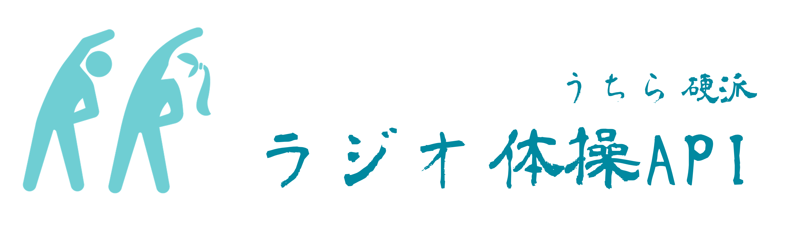

<p align="center">
    <a href="LICENSE" target="_blank">
        
    </a>
    <a href="https://en.wikipedia.org/wiki/Hippopotamus" target="_blank">
        
    </a>
    <a href="https://github.com/yoshihiro-maeda-cc/nri-3-api-solo-demo" target="_blank">
        
    </a>
    <a href="https://github.com/yoshihiro-maeda-cc/nri-3-api-solo-demo/search?l=javascript" target="_blank">
        
    </a>
    <a href="https://github.com/issues" target="_blank">
        
    </a>
    <a href="https://github.com/issues?q=is%3Aclosed+is%3Aissue+author%3Ayoshihiro-maeda-cc+archived%3Afalse+" target="_blank">
        
    </a>
    <a href="https://github.com/yoshihiro-maeda-cc/nri-3-api-solo-demo/commits/main" target="_blank">
        
    </a>
</p>

> ⚠️ これは完全なるジョークプロジェクトです。書いてあることを決して鵜呑みにしないでください。

これは全国各地のラジオ体操動画の情報を取得する API です。

## 🛠️ Installation

```bash
npm install
```

## 🚀 Serving API

サーバ起動

```bash
npm run start
```

サーバ起動（ホットリロード）

```bash
npm run dev
```

## 📖 Documentation

### 👀 Overview

[presentation slide](./docs/presentation/Presentation.pdf)

### 🔎 API Docs

ブラウザで [/api-docs](http://localhost:3000/api-docs) にアクセスしてください。

### 🛝 Playground

[ルートURL](http://localhost:3000/) へアクセスすることで画面サンプルを見ることができます。

## 👮‍♂️ Our Policy

私達は全国の硬派なラジオ体操を求めています。利用に際し以下の条件がありますのでご注意ください。

✅ 推奨事項

- 硬派なラジオ体操動画を投稿すること
- 軟派なラジオ体操を見つけたら管理者に報告すること

🆖 禁止事項

- 存在しない動画 ID を投稿すること
- 軟派なラジオ体操動画を投稿すること
